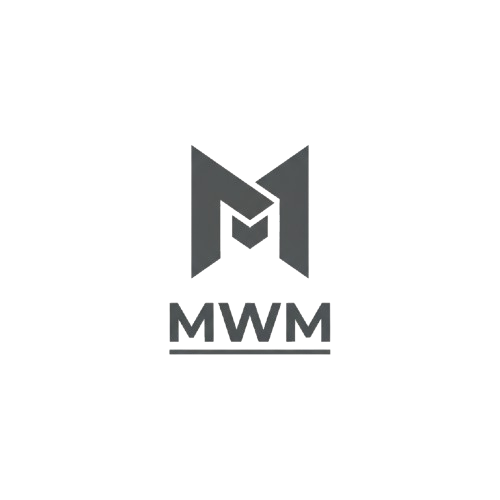

MWM (Mac Window Manager) is an experimental tiling window manager for macOS.

## Features

- BSP (Binary Space Partitioning) layout algorithm
- Menu bar application with global hotkeys
- Accessibility API integration for window control
- Configurable gaps, padding, and master ratio
- Workspace support using macOS native Spaces (Mission Control)
- Hotkey-based Space switching (Cmd+1-9) and window movement (Cmd+Shift+1-9)

## Architecture

```
┌─────────────────────────────────────┐
│         Swift UI Layer              │
│  - Menu bar app                     │
│  - Accessibility permissions        │
│  - AXUIElement window control       │
│  - Window event observers           │
│  - Hotkey registration              │
└──────────────┬──────────────────────┘
               │ C ABI Bridge
               │
┌──────────────▼──────────────────────┐
│         Zig Core Logic              │
│  - Window registry                  │
│  - Layout algorithms (BSP, etc)     │
│  - Event processing                 │
│  - Configuration management         │
└─────────────────────────────────────┘
```

> This separation deliberately keeps platform-agnostic tiling logic in Zig for portability to other window systems (X11, Wayland) while Swift handles macOS-specific APIs.

## Requirements

- macOS 13.0+
- mise (for tool version management)
- Accessibility permissions

## Building

```bash
# Build application
mise run build

# Run tests
mise run test

# Run application
mise run run

# Clean artifacts
mise run clean
```

## Installation

```bash
mise run install
```

Installs binary to `/usr/local/bin/mwm`.

## Usage

1. Grant accessibility permissions when prompted (System Preferences → Security & Privacy → Privacy → Accessibility)
2. **Enable Space switching shortcuts:** System Preferences → Keyboard → Shortcuts → Mission Control → Enable "Switch to Desktop 1-9"
3. Run `mise run run` or launch the application directly
4. See [HOTKEYS.md](HOTKEYS.md) for keyboard shortcuts

Menu options:
- About MWM
- Request Accessibility Permission
- Show Hotkeys
- Debug: Print Windows
- Quit

## Debugging

View logs in Console.app or run `mise run run` for terminal output. Logs include window enumeration, layout calculations, and hotkey events.

## Project Structure

```
mwm/
├── build.zig             # Zig build configuration
├── Package.swift         # Swift package configuration
├── .mise.toml            # Tool versions and tasks
├── docs/                 # Documentation
│   ├── README.md         # Documentation index
│   └── WINDOW_MOVEMENT_TEST_GUIDE.md
├── include/
│   └── mwm_bridge.h      # C ABI header
├── src/                  # Zig source code
│   ├── core.zig          # Window manager core
│   ├── window.zig        # Window structures
│   ├── layout.zig        # Layout algorithms
│   └── bridge.zig        # C ABI exports
└── Sources/MWM/          # Swift source code
    ├── main.swift
    ├── AppDelegate.swift
    ├── AccessibilityManager.swift
    ├── WindowManagerBridge.swift
    ├── WindowObserver.swift
    ├── HotkeyManager.swift
    └── SpaceManager.swift
```

## Configuration

Default configuration:
- Gaps: 10px
- Padding: 10px
- Master ratio: 50%

## Roadmap

- [x] Window manipulation commands
- [x] Global hotkey support
- [x] Automated testing
- [x] Workspace (Space) support with hotkey switching
- [ ] Floating window mode
- [ ] Multi-monitor support
- [ ] Additional layout algorithms
- [ ] Configuration file support
- [ ] Per-application window rules

## Technical Notes

### Workspace (Space) Support

MWM integrates with macOS Spaces using a hybrid approach:

**Space Detection (CGS Private API):**
- Uses `CGSCopySpaces` to detect all available Spaces
- Uses `CGSGetActiveSpace` to identify current Space
- Uses `CGSMainConnectionID` for connection management

**Space Switching (Keyboard Shortcuts):**
- **Method:** Simulates `Ctrl+1-9` keyboard shortcuts
- **Why:** CGS `CGSShowSpaces` API exists but doesn't function on modern macOS
- **Requirement:** User must enable "Switch to Desktop 1-9" in System Preferences → Keyboard → Shortcuts → Mission Control
- **Mapping:** MWM's `Cmd+1-9` hotkeys internally trigger `Ctrl+1-9` shortcuts
- **Benefit:** More reliable and compatible across macOS versions

**Window Movement (Amethyst's Approach):**
- **Method:** Simulates dragging a window while switching Spaces
- **How:** Grabs window via mouse events, triggers space-switch hotkey, releases window
- **Why:** CGS APIs (`CGSAddWindowsToSpaces`/`CGSRemoveWindowsFromSpaces`) are broken on modern macOS
- **Timing:** ~500ms (50ms grab + 400ms space animation)
- **APIs Used:**
  - `CGSGetSymbolicHotKeyValue` - Detects user's configured space-switch hotkeys
  - `CGSIsSymbolicHotKeyEnabled` - Checks if hotkeys are enabled
  - `CGSSetSymbolicHotKeyEnabled` - Temporarily enables disabled hotkeys
  - `CGEvent` mouse/keyboard simulation - Performs the drag-and-switch
- **Benefit:** Actually works! Only reliable method on macOS 13+

### Setup Required

**For workspace switching (`Cmd+1-9`) and window movement (`Cmd+Shift+1-9`):**
1. Open **System Preferences → Keyboard → Shortcuts → Mission Control**
2. Enable "Switch to Desktop 1" through "Switch to Desktop 9"
3. Ensure shortcuts are set to `^1` through `^9` (Ctrl+number, default)
4. Create at least 2 Spaces via Mission Control (F3 or swipe up with 3 fingers)

**Note:** MWM uses keyboard shortcut simulation because CGS private switching APIs are non-functional on recent macOS versions, making this the most reliable cross-version approach.

**Important:** Private APIs may change in future macOS versions. The core window management uses only public Accessibility APIs and will continue to work even if Space features are affected.

For complete technical details about workspace implementation, see [docs/README.md](docs/README.md).
